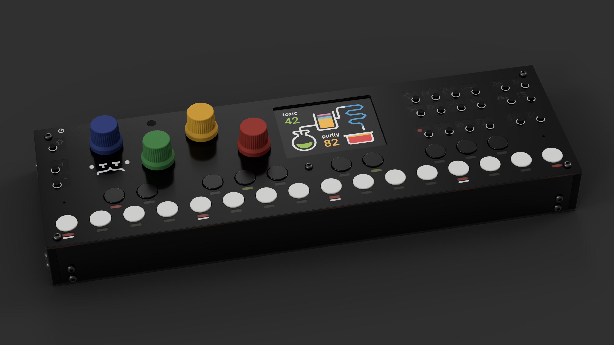
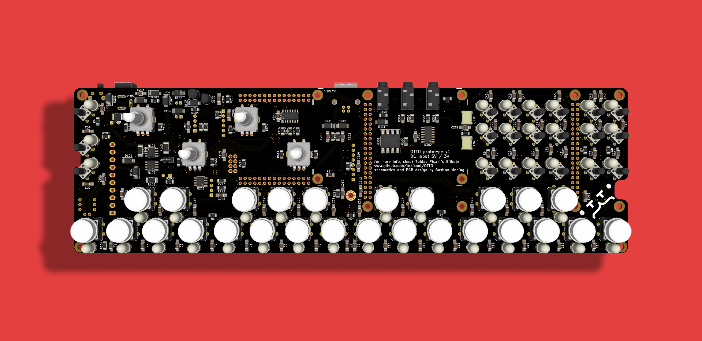
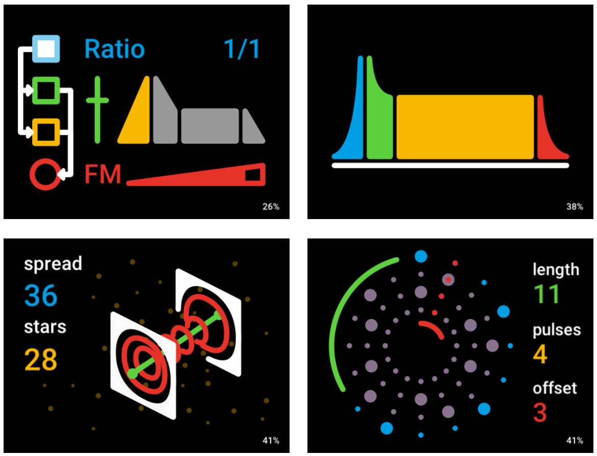

The OTTO
========

<PatreonBadge/>

The OTTO is a digital hardware groovebox, with synths, samplers, effects and a sequencer with an audio looper. The interface is flat, modular and easy to use, but most of all, it aims to encourage experimentation. The workflow is intended to be minimalistic with a minimum of menu-diving and everything at most a couple of intuitive button presses away.

We would like to invite you to our **[discord server](/discord)** where we hang out and discuss all things OTTO.

## Prototype Demo

<YouTube videoId="nBDd2tuIafM"/>

This is a demo of an early prototype unit, with only a few features implemented. 

## State of the project

We're working on a beta version, and rewriting some things to make it run more reliably. This beta version will be sold in a limited quantity, with Patreon backers getting the first chance.

At first, we will be selling finished units, not DIY kits. These might be possible at a later stage.

## Planned Features

The ones marked will be available in the beta.

- [x] A synth for live performance with midi effects (arpeggiator, etc.)
- [x] 2 FX slots. Synths and drums send to them as a FX bus.
- [x] Synths and effects are swappable "engines".
- [x] An audio line input which has FX send and level
- [ ] For drums, a sampler will run in parallel to the sequencer-synth chain. 
- [ ] The drum sampler has 10 channels. These have a simple 1-bar, 16 step drum sequencer, with each step 
      corresponding to a white key on the keyboard.
- [ ] A simple loop-station-style audio looper that can get audio from line in or synth. 
      It has overdub and one level of Undo.
- [ ] 8 save slots which save the state of the entire system. A save button lets you choose the slot to save in. Saves are only performed when you take the action.

## The software
The main application running all the audio, graphics and logic code is located in [this GitHub repository](https://github.com/OTTO-project/OTTO). If you are an audio or graphics designer or a musician, this is probably where you want to look.

OTTO runs on a custom Linux distro. The Yocto project in [this](https://github.com/OTTO-project/otto-bsp) repository handles the cross-compilation, drivers and packaging of the entire system. If you have experience with embedded systems and want to know how OTTO works, take a look here.

## The hardware

The OTTO hardware has a Raspberry Pi 3A+ at the core of a custom PCB with the buttons, a screen, 4 encoders, tons of RGB LEDs, and a MCU controlling the I/O. It also contains a DAC for audio I/O.

We are working on the hardware in a public [GitHub repository](https://github.com/OTTO-project/otto-hardware) so you can follow along and come with inputs.

## Screenshots

The UI tries to walk the line between clear, concise and playful:

